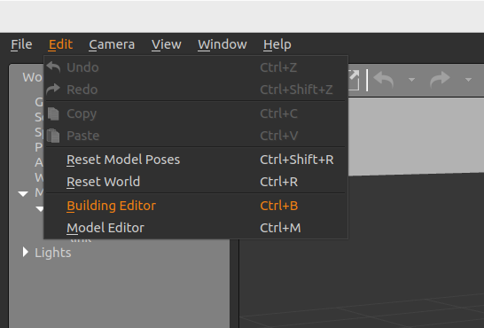

## How to Create a Custom World in Gazebo for Your Robotics Simulation?

This blog post is intended for beginners in ROS/Gazebo simulation. Anyone interested in virtual testing before real-world deployment must master ROS/Gazebo. Gazebo is an open-source robotics simulator that allows developers to create, test, and validate robots in realistic environments — all without needing physical hardware. In this blog post we shortly create custom gazebo world.

## Pre-request
- Ensure Gazebo is installed
- ROS 2 (optional)
- Basic knowledge of .world and .sdf files

## step 1: 2D Floor Plan
We start by opening gazebo from our terminal, and simply type gazebo and press enter.
```
gazebo
```
The default gazebo world has "ground plane" and "sun" as shown in the image below.


I will build my custom world by either importing 2D floor plan or simply drawing floor plan of desired shape inside Building Editor by clicking the Edit in the menu bar.



Here, I created my gazebo world from imported 2D floor plan. I just click on the "import" tab below the textures, and follow the procedures by setting up the ratio of measurement and resolution.


After drawing the walls and applying the desired texture and colors. We save the gazebo by clicking on the "File >> Save as" and then exit from "File >>Exit Building Editor" the final 3D view of the gazebo world looks like this.

Note: After Exit Builing Editor there is no way you can edit it again so make sure you finalized it first.


You can add some models of objects from gazebo itself. To do so on the top section just click the "Insert" tab next to "wrold", you will get a lot of models for example I added table to the world, and save the configuration as block_one.world.


If I want to launch the file again then I will open the terminal window, then go to the directory of my file and launch it as follows.
```
cd my_world
gazebo block_one.world
```